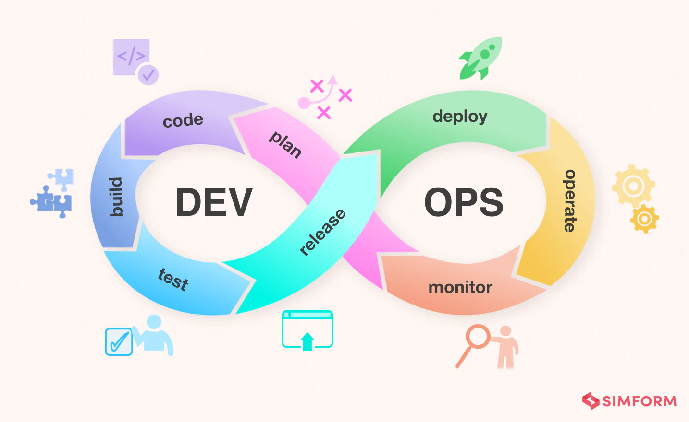

# Software Engineering

Peter McIntyre

Principal Software Engineer

---

## What We'll Cover Today

- The Software Development Lifecycle (SDLC)
- The technical stack & tools we use
- Agile & ways of working
- Real challenges you'll face
- What to expect in your career

---

## The Software Development Lifecycle

Or: How software actually gets built

---

### Textbook SDLC

Plan → Build → Test → Release → Monitor

---

### SDLC vs Agile vs DevOps

You'll hear these terms constantly - here's how they fit together:

- **SDLC:** The overall framework for building software (the "what")
- **Agile:** A methodology for working iteratively and flexibly (the "how" for development)
- **DevOps:** A culture of automation and continuous delivery (the "how" for shipping)

They work together: SDLC is the structure, Agile is how you develop, DevOps is how you deliver.

---

### Agile

< insert the agile meme about building a car >

---

### DevOps



---

### The Reality

- It's a **continuous loop**, not linear
- Monitoring feeds back into planning
- You're often coding, testing, and fixing simultaneously
- Production issues interrupt everything
- Requirements change mid-sprint

---

## The Technical Stack

Tools you'll use every single day

< big image of all the logos >

---

# Tools

> An IDE, CLI, and version control is all you really need to be productive.
> Everything else is just convenience.
- Claude

source controle (git)
containers (docker)
termnial (bash)

---

# Tasks

technical documentation
managing work
tech debt
rubber duck
whiteboard

---

### Development Environment

- **IDE:** VS Code, IntelliJ, etc.
- **Version Control:** Git (GitHub, GitLab, Bitbucket)
- **Local Environment:** Docker, Docker Compose
- **Package Managers:** npm, pip, maven, gradle

Git is non-negotiable. Learn it well.

---

### The CI/CD Pipeline

Continuous Integration / Continuous Deployment

- **CI Tools:** Jenkins, GitHub Actions, GitLab CI, CircleCI
- **What happens:**
  1. You push code to a branch
  2. Pipeline runs: lint, unit tests, integration tests
  3. Build Docker image
  4. Push to container registry
  5. Deploy to dev/staging environment
  6. Automated tests run in staging
  7. Manual approval for production
  8. Deploy to production

---

### Cloud Infrastructure (AWS)

**Compute**
- EC2 (virtual servers)
- ECS (containers)
- Lambda (serverless)

**Storage**
- S3 (object storage)
- RDS (databases)
- DynamoDB (NoSQL)

**Networking**
- VPC (private networks)
- Load Balancers
- CloudFront (CDN)

**Infrastructure as Code**
- Terraform
- CloudFormation

---

### Monitoring & Observability

- **Application Monitoring:** DataDog, New Relic, Dynatrace
- **Error Tracking:** Sentry, Rollbar
- **Logs:** CloudWatch, Elasticsearch/Kibana, Splunk
- **Metrics:** Prometheus, Grafana
- **Alerting:** PagerDuty, OpsGenie

If you can't measure it, you can't improve it.

---

### Example: Deploying a Feature

```bash
# 1. Create feature branch
git checkout -b feature/user-notifications

# 2. Write code, commit frequently
git add .
git commit -m "Add notification service"

# 3. Push and open Pull Request
git push origin feature/user-notifications

# 4. CI runs automatically:
#    - Linting (ESLint, Prettier)
#    - Unit tests (Jest, pytest)
#    - Security scans (Snyk)
#    - Build Docker image
#    - Deploy to dev environment

# 5. Code review from team
# 6. Merge to main
# 7. Auto-deploy to staging
# 8. QA testing
# 9. Deploy to production
```

---

## Agile in Practice

How teams actually work together

---

### The Sprint Cycle (2 weeks)

- **Sprint Planning:** Team picks work from backlog for next 2 weeks
- **Daily Standup:** 15min sync - what did you do? what will you do? any blockers?
- **Sprint Work:** Code, review, deploy, repeat
- **Sprint Review:** Demo completed work to stakeholders
- **Retrospective:** What went well? What can improve?

Then repeat. Forever.

---

### Tickets & Story Points

- **Tools:** Jira, Linear, Azure DevOps
- **Story Points:** Relative effort (1, 2, 3, 5, 8, 13)
- **Ticket States:** Backlog → In Progress → Code Review → QA → Done
- Your velocity improves as you learn the system

---

### Code Reviews

One of the most important practices

- **Why:** Catch bugs, share knowledge, maintain quality
- **What reviewers look for:**
  - Does it solve the problem?
  - Are there bugs or edge cases?
  - Is it readable and maintainable?
  - Does it follow team conventions?
  - Are tests included?
- **Pro tip:** Small PRs get reviewed faster

---

### Collaboration is Key

- You'll spend more time communicating than coding
- Slack/Teams for async communication
- Video calls for complex discussions
- Documentation for knowledge sharing
- Pair programming for complex problems

Software engineering is a team sport.

---

## Real Challenges

The stuff they don't tell you in tutorials

---

### Production Incidents

- **It's not "if", it's "when"**
- **On-call rotation:** You're responsible for production health
- **Incident response:**
  1. Alert fires (PagerDuty wakes you up)
  2. Assess impact and severity
  3. Mitigate/rollback if needed
  4. Investigate root cause
  5. Write postmortem
  6. Implement fixes to prevent recurrence
- **Blameless culture:** Focus on systems, not individuals

---

### Legacy Code & Technical Debt

- You'll spend more time reading code than writing it
- Most codebases are 5-10+ years old
- Technical debt accumulates from:
  - Rushed deadlines
  - Changing requirements
  - Technologies becoming outdated
  - People leaving and taking context with them
- Balance: new features vs. paying down debt

---

### Scaling Challenges

- **Performance:** What works for 100 users doesn't work for 1M
- **Database bottlenecks:** Query optimization, caching, sharding
- **Distributed systems:** Multiple services, eventual consistency
- **Load balancing:** Spreading traffic across servers
- **Cost optimization:** AWS bills can get expensive fast

Premature optimization is evil, but so is ignoring scale.

---

### Making Tradeoffs

**Perfect Solution**
- 100% test coverage
- Fully documented
- Zero technical debt
- Handles all edge cases
- Takes 6 months

**Good Enough**
- 80% test coverage
- Key parts documented
- Some technical debt
- Handles common cases
- Ships in 6 weeks

Shipping imperfect software beats perfect software that never ships.

---

### Working with Ambiguity

- Requirements are rarely crystal clear
- Ask questions early and often
- Build MVPs to validate assumptions
- User feedback will change everything anyway

---

## What to Expect in Your Career

The journey from junior to principal

---

### Junior → Mid → Senior → Principal

- **Junior (0-2 years):** Learn the basics, fix bugs, build features with guidance
- **Mid (2-5 years):** Own features end-to-end, mentor juniors, less supervision
- **Senior (5-10 years):** Design systems, lead projects, make architectural decisions
- **Principal (10+ years):** Set technical direction, solve org-wide problems, influence strategy

These are rough guidelines. Focus on impact, not titles.

---

### Your First Job

- You won't know everything (nobody does)
- Imposter syndrome is normal
- Ask questions - it's expected
- Focus on learning, not looking smart
- Find a mentor or senior to learn from
- You'll make mistakes - own them and learn

---

### Continuous Learning

- Technology changes constantly
- What you learn in university is just the foundation
- Ways to keep learning:
  - Read other people's code
  - Contribute to open source
  - Build side projects
  - Read documentation (seriously)
  - Follow industry blogs and conferences
  - Learn from production incidents
- Focus on fundamentals that don't change: algorithms, data structures, design patterns

---

### Red Flags in Companies

- No code reviews or testing
- Constant firefighting, no time for improvement
- Blame culture around mistakes
- No documentation or knowledge sharing
- Unlimited overtime expectations
- No investment in developer tools or training

---

### Green Flags in Companies

- Strong engineering culture
- Automated CI/CD and testing
- Blameless postmortems
- Time allocated for tech debt and learning
- Good documentation and onboarding
- Healthy work-life balance
- Clear career progression paths

---

### Skills Beyond Code

- **Communication:** Explaining technical concepts clearly
- **Empathy:** Understanding user needs and team dynamics
- **Time management:** Balancing multiple priorities
- **Problem-solving:** Breaking down complex problems
- **Adaptability:** Technologies and priorities change

These "soft skills" become more important as you advance.

---

## Key Takeaways

- Software delivery is a cycle, not a waterfall
- Master the tools: Git, CI/CD, cloud platforms
- Agile is about people and iteration, not just process
- You'll spend more time on maintenance than greenfield
- Communication and collaboration > solo coding
- Keep learning, stay curious, ask questions
- Find a company with good engineering culture

---

# Questions?

Ask me anything about software delivery, career paths, or working in the industry
