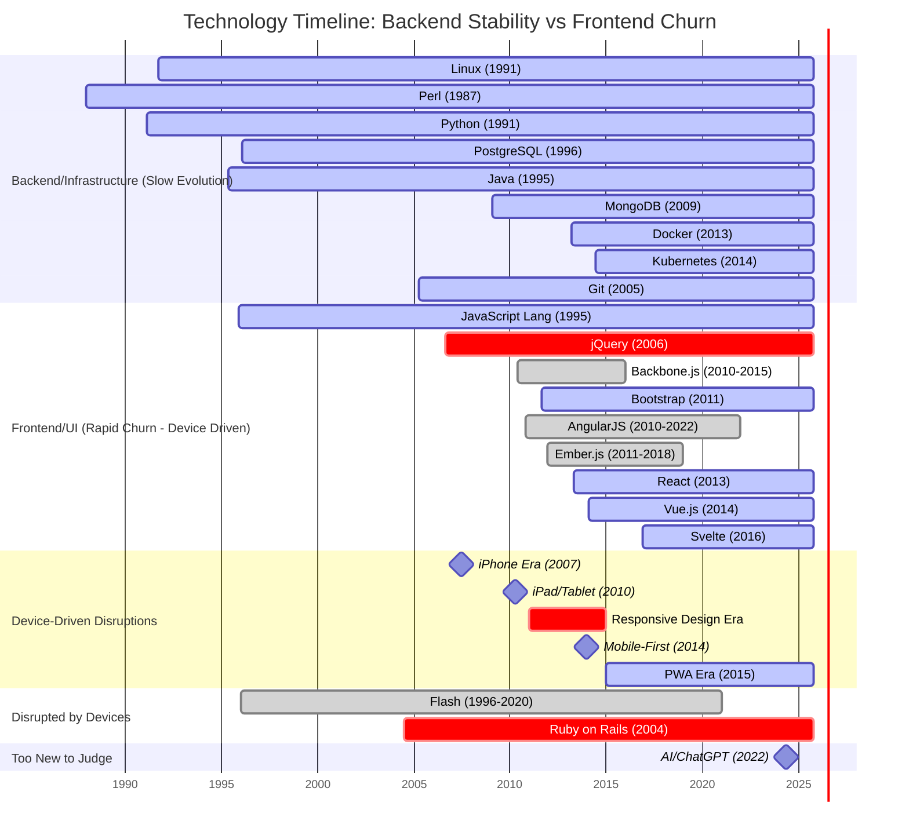

# Technology Timeline: Choose Boring Tech (Layered by Evolution Rate)

This Mermaid Gantt chart illustrates the lifespan and staying power of various technologies, demonstrating a crucial insight: **backend/infrastructure technologies evolve slowly and remain stable, while frontend/UI technologies churn rapidly in response to new devices and user expectations**.



## Key Insights: The Layer Matters

### Backend/Infrastructure: The Boring Winners (Slow Evolution)

**Why backends are stable:**
- Data structures and algorithms don't change
- Business logic is device-agnostic
- Performance and reliability matter more than aesthetics
- Breaking changes are expensive at scale

**The Champions (25+ years old):**
- **Linux** (34 years): OS fundamentals don't change
- **Perl** (38 years): Text processing is text processing
- **Python** (34 years): Clean syntax ages well
- **Java** (30 years): Enterprise inertia is real
- **PostgreSQL** (29 years): ACID compliance is timeless

**The Modern Standards (10-15 years):**
- **Git** (20 years): Version control solved problem
- **Docker** (12 years): Containers became standard
- **Kubernetes** (11 years): Orchestration winner
- **MongoDB** (16 years): NoSQL found its niche

### Frontend/UI: The Rapid Churn (Device-Driven Evolution)

**Why frontends churn rapidly:**
- **New devices = new constraints**: iPhone (2007), iPad (2010), tablets, watches, AR/VR
- **Screen sizes exploded**: From 320px to 4K displays
- **Touch vs mouse vs voice**: Interaction paradigms keep changing
- **Performance expectations**: 3G → 4G → 5G changed what's possible
- **User expectations evolve**: Modern users demand app-like web experiences

**The Device-Driven Timeline:**

1. **2007 - iPhone Launch**: Killed Flash, forced rethinking of web interfaces
2. **2010 - iPad**: Introduced the "in-between" form factor
3. **2011-2014 - Responsive Design Era**: Bootstrap (2011), mobile-first philosophy
4. **2013-Present - JavaScript Framework Wars**:
   - Backbone (2010) → dead by 2015 (2-5 year lifespan)
   - AngularJS (2010) → killed by own successor (2010-2022)
   - Ember (2011) → declined by 2018 (7 year peak)
   - React (2013) → current king (12 years and counting)
   - Vue (2014) → rising challenger (11 years)
   - Svelte (2016) → newest contender (9 years)
5. **2015-Present - PWA Era**: Bridging web and native apps

### The Cautionary Tales

**Flash (1996-2020)**: The ultimate device disruption story
- Dominated for 24 years on desktop
- iPhone refused to support it (2007)
- Dead within 13 years of mobile revolution
- **Lesson**: UI tech tied to specific devices dies with those devices

**AngularJS (2010-2022)**: Framework breaking changes
- Google's own framework killed by Google
- Breaking changes between v1 and v2 destroyed trust
- Community scattered to React/Vue
- **Lesson**: Frontend frameworks have 3-5 year lifespans before major rewrites

**jQuery (2006-declining)**: Still powers 77% of websites but...
- Was essential when browsers were inconsistent
- Modern JavaScript and frameworks reduced need
- Still alive but declining in new projects
- **Lesson**: Frontend utility libraries age out as browsers improve

**Backbone/Ember (2010-2015)**: The 5-year frontend cycle
- Rose quickly 2010-2013
- Declined 2014-2018
- Essentially dead by 2018
- **Lesson**: Frontend frameworks have brutal lifecycles

### The Pattern Is Clear

```
Backend/Infrastructure lifespan: 20-40+ years
Frontend/UI Framework lifespan: 3-7 years (with churn every 2-3 years)
```

**Why?**
1. **Backends solve fundamental problems**: Data storage, processing, networking don't change
2. **Frontends respond to context**: New devices, screen sizes, input methods, user expectations
3. **User-facing tech evolves with users**: Today's "innovative UI" is tomorrow's "dated interface"
4. **Infrastructure is invisible**: Users don't care what database you use
5. **UI is highly visible**: Users immediately notice outdated interfaces

## The Revised Moral: Choose Boring Tech... By Layer

### For Backend/Infrastructure:
**Always choose boring tech** - these technologies prove their worth over decades
- Databases: PostgreSQL, MySQL (not the new hotness)
- Languages: Python, Java, Go (not the latest language)
- Infrastructure: Linux, Docker, Kubernetes (battle-tested)
- Tools: Git, Make, SSH (solved problems stay solved)

### For Frontend/UI:
**Accept the churn, but choose wisely:**
- Expect to rewrite every 5-7 years as devices/expectations evolve
- Choose frameworks with momentum (React, Vue currently)
- Prioritize community size over "innovative features"
- Use progressive enhancement (HTML/CSS last 30 years, frameworks don't)
- Consider that today's React will be tomorrow's jQuery
- **Key insight**: You're not choosing a 20-year framework, you're choosing a 5-year one

### The Device Factor

Frontend technology lifespan is inversely correlated with device evolution:
- **1995-2007** (12 years): Desktop era, relatively stable (basic JavaScript/CSS)
- **2007-2010** (3 years): iPhone disruption, massive change
- **2010-2014** (4 years): Tablet era, responsive design revolution
- **2014-2020** (6 years): Mobile-first stabilization, framework wars
- **2020-present**: PWAs, app-like experiences, framework consolidation

**Each new device category (phone, tablet, watch, AR/VR) triggers a frontend revolution.**

## Conclusion

The "choose boring tech" advice is **layer-dependent**:

- **Backend**: Boring tech lasts 20-40 years. Choose the oldest, most stable option.
- **Frontend**: Even "stable" frameworks last 5-10 years. Choose community momentum, accept rewrites.
- **Devices drive frontend evolution**: New form factors → new UI paradigms → new frameworks

**The real wisdom**: Separate your layers. Build on boring backends that last decades. Accept that frontends will churn with devices and user expectations. Plan for frontend rewrites every 5-7 years, not as technical debt, but as necessary evolution in response to changing human-computer interaction patterns.
